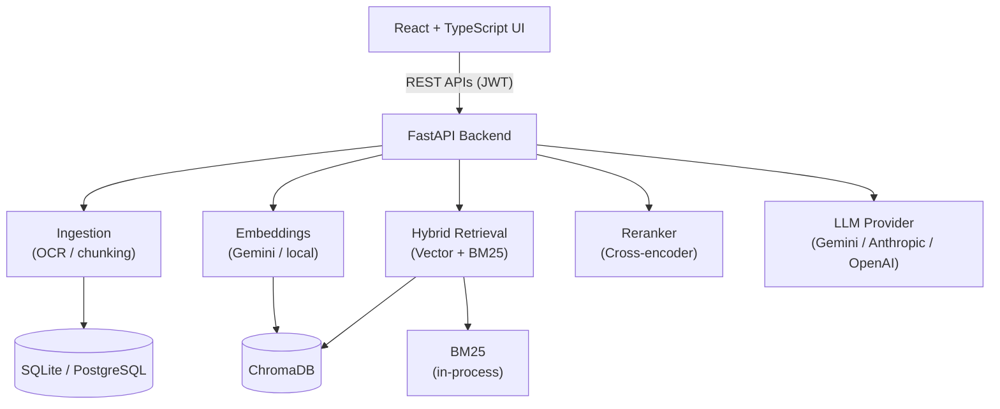

# DocuRAG – Universal Document Intelligence & RAG Platform

A production-style full-stack Retrieval-Augmented Generation platform.

---

## Upload • Ask • Cite • Evaluate

A full-stack RAG platform that lets users upload documents into knowledge bases, ask natural-language questions, and get grounded answers with exact page-level citations — backed by hybrid retrieval, cross-encoder reranking, hallucination detection, and a real evaluation engine that measures retrieval and generation quality from live pipeline runs, not hard-coded numbers.

Built with **React, TypeScript, FastAPI, Python, ChromaDB, SQLAlchemy, and the Gemini API**.

## 📖 Overview

DocuRAG demonstrates a complete modern RAG pipeline rather than a basic "chat with PDF" demo: document ingestion with OCR fallback, structure-aware chunking, hybrid vector + BM25 retrieval, reranking, conversational query rewriting, grounded generation with citation traceability, and a developer-facing retrieval debugger and evaluation dashboard.

The project follows a modular, provider-agnostic architecture — every AI component (LLM, embeddings, reranker) is swappable via environment variables with zero hard-coded API keys — deployed with Docker and hosted on Render.

## ✨ Highlights

- 📄 Multi-format document ingestion (PDF, DOCX, PPTX, TXT, Markdown, CSV) with OCR fallback for scanned pages
- 🔍 Hybrid retrieval — semantic vector search + BM25 keyword search, fused with configurable weights
- 🎯 Cross-encoder reranking on top of hybrid candidates
- 💬 Conversational RAG with automatic query rewriting for follow-up questions
- 📌 Citation traceability — every claim links back to a real document, page, and chunk, never invented
- 🛡️ Hallucination / "not found" detection with an honest HIGH/MEDIUM/LOW grounding signal
- 🐛 Retrieval debugger showing vector/BM25/reranker scores behind any answer
- 🧪 Evaluation engine computing real retrieval recall, context precision, faithfulness, citation accuracy, and unanswerable-question detection
- 📊 A/B experiment comparison (e.g. hybrid+reranker vs. vector-only baseline)
- 🔐 JWT authentication with per-user knowledge-base isolation
- ⚡ Rate limiting and multi-layer caching (embeddings, retrieval, FAQ answers)
- 🧩 Pluggable AI providers — Anthropic, OpenAI, or Gemini for LLM and embeddings, switchable via env vars
- 🌙 Responsive dark/light UI with skeleton loaders and toast notifications

## ✨ Features

### 🤖 Grounded Question Answering
- Retrieval-grounded answers with inline `[n]` citation markers
- Click-through source viewer showing the exact retrieved page and passage
- Explicit refusal ("insufficient information") instead of fabricated answers
- Conversational follow-ups with automatic query rewriting from chat history
- Optional agentic mode that plans and runs multiple sub-searches for comparison-style questions

### 📚 Knowledge Base Management
- Multiple isolated knowledge bases per user
- Drag-and-drop upload with live per-stage processing status (UPLOADING → OCR → CHUNKING → EMBEDDING → INDEXING → COMPLETED)
- Structure-aware chunking (page/section/heading-preserving, configurable size and overlap)

### 🔎 Search & Retrieval
- Raw hybrid search view showing vector, BM25, and combined scores per chunk
- Metadata filtering by document or file type
- Document comparison — structured CHANGED / ADDED / REMOVED / UNCHANGED analysis across two or more documents

### 📝 Content Tools
- Hierarchical map-reduce summarization for long documents (never blindly stuffs a whole document into the LLM)
- Multiple summary modes (executive summary, TL;DR, key points, explain simply)
- Quiz/question generation at easy/medium/hard difficulty, each grounded to a source citation

### 🧪 Developer / Evaluation Tools
- Retrieval debugger: full query → candidates → reranking → final context → answer trace
- Evaluation dataset builder with answerable/unanswerable ground-truth questions
- Real metrics computed from live pipeline runs: retrieval recall, context precision, answer faithfulness, citation accuracy, answer relevance, unanswerable detection
- Experiment history and baseline (vector-only, no reranker) comparison runs

### 🔐 Security
- JWT authentication, per-user knowledge-base isolation enforced at the query level
- Documents treated as untrusted data — prompt-injection defenses with an adversarial test suite
- File type/size validation, rate limiting on every LLM-backed endpoint, no client-exposed API keys

## 🏗️ System Architecture




## 🛠️ Tech Stack

**Frontend**
- React
- TypeScript
- Vite
- Tailwind CSS
- React Router
- Axios

**Backend**
- Python
- FastAPI
- SQLAlchemy (SQLite / PostgreSQL)
- ChromaDB (vector store)
- rank-bm25 (keyword search)
- PyMuPDF, python-docx, python-pptx, pandas (document processing)
- pytesseract (OCR)

**AI & External Services**
- Gemini API (LLM + embeddings)
- Anthropic API (alternative LLM provider)
- OpenAI API (alternative LLM/embedding provider)
- sentence-transformers (local embedding option)

**Infrastructure**
- Docker / Docker Compose
- Render (deployment)

## 📈 Project Statistics

| Category | Details |
|---|---|
| Architecture | Full-stack, modular RAG pipeline |
| Frontend | React + TypeScript |
| Backend | Python + FastAPI |
| Database | SQLite (dev) / PostgreSQL-ready |
| Vector Store | ChromaDB |
| Authentication | JWT |
| AI Integration | Gemini / Anthropic / OpenAI (pluggable) |
| Retrieval | Hybrid vector + BM25 with reranking |
| UI | Tailwind CSS, dark/light mode |

## 📂 Project Structure

```
docurag
│
├── backend
│   ├── app
│   │   ├── api            # route handlers
│   │   ├── core           # config, database, security, caching, rate limiting
│   │   ├── models         # SQLAlchemy models
│   │   ├── schemas        # Pydantic request/response schemas
│   │   └── services
│   │       ├── ingestion      # extraction, OCR, chunking
│   │       ├── embeddings     # pluggable embedding providers
│   │       ├── vectorstore    # ChromaDB wrapper
│   │       ├── retrieval      # BM25, hybrid fusion, reranking, query rewriting
│   │       ├── llm            # pluggable LLM providers
│   │       ├── rag            # prompts, grounding, pipeline, agentic mode
│   │       ├── processing     # background document pipeline
│   │       └── eval           # evaluation engine
│   ├── requirements.txt
│   └── Dockerfile
│
├── frontend
│   ├── src
│   │   ├── api             # typed API client
│   │   ├── components
│   │   ├── context         # auth, theme
│   │   └── pages
│   └── Dockerfile
│
├── docker-compose.yml
└── README.md
```


## 🚀 Getting Started

### 1️⃣ Clone Repository
```bash
git clone https://github.com/prigya-goyal/docurag.git
cd docurag
```

### 2️⃣ Backend Setup
```bash
cd backend
cp .env.example .env

# Configure your environment variables:
# SECRET_KEY
# LLM_PROVIDER (anthropic | openai | gemini)
# GEMINI_API_KEY / ANTHROPIC_API_KEY / OPENAI_API_KEY
# EMBEDDING_PROVIDER (local | openai | gemini)

python -m venv .venv
.venv\Scripts\Activate.ps1   # Windows, or: source .venv/bin/activate on Mac/Linux
pip install -r requirements.txt
uvicorn app.main:app --reload
```
Backend runs on:

http://localhost:8000


### 3️⃣ Frontend Setup
```bash
cd frontend
cp .env.example .env
npm install
npm run dev
```
Frontend runs on:

http://localhost:5173


### 4️⃣ Docker (alternative)
```bash
docker compose up --build
```

## 🔑 Environment Variables

Create a `.env` file inside the `backend` directory.

SECRET_KEY=
DATABASE_URL=sqlite:///./docurag.db

LLM_PROVIDER=gemini
GEMINI_API_KEY=
GEMINI_MODEL=gemini-3.1-flash-lite

EMBEDDING_PROVIDER=gemini
GEMINI_EMBEDDING_MODEL=gemini-embedding-001

RERANKER_ENABLED=true


## ✅ Implemented Features

✔ JWT Authentication
✔ Knowledge base management (create, rename, delete)
✔ Multi-format document upload with async processing
✔ OCR fallback for scanned PDFs
✔ Structure-aware chunking
✔ Hybrid retrieval (vector + BM25)
✔ Cross-encoder reranking
✔ Conversational RAG with query rewriting
✔ Citation-grounded answers with source viewer
✔ Hallucination / not-found detection
✔ Document comparison
✔ Hierarchical summarization
✔ Quiz question generation
✔ Retrieval debugger
✔ RAG evaluation engine with real metrics
✔ Experiment A/B comparison
✔ Rate limiting & multi-layer caching
✔ Dark/light theme
✔ Docker deployment

## 💡 Engineering Highlights

- Modular, provider-agnostic AI architecture (LLM, embeddings, reranker all swappable)
- Clean separation of ingestion, retrieval, reranking, generation, and evaluation
- Prompt-injection resistant design with an adversarial test suite
- Real evaluation metrics computed from live runs — never fabricated
- Per-user data isolation enforced at the query level
- RESTful API design with FastAPI + Pydantic validation

## 🚀 Future Enhancements

- Knowledge graph-based retrieval
- Multimodal RAG (charts, tables, images inside PDFs)
- Persistent disk / managed Postgres for production durability
- Celery + Redis for distributed background processing
- CI/CD pipeline

## 🤝 Contributing

Contributions are welcome!

1. Fork the repository
2. Create your feature branch: `git checkout -b feature-name`
3. Commit your changes: `git commit -m "Add new feature"`
4. Push to GitHub: `git push origin feature-name`
5. Open a Pull Request

## 📜 License

This project is licensed under the MIT License.

## 👩‍💻 Author

**Prigya Goyal**
B.Tech Computer Engineering Student

